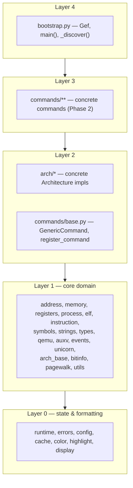

# GEF Architecture

**Status: Phase 1 (as of 2026-09-16).** The monolithic `gef.py` has been split into the `gef/` package. Core domain modules, all 20 architecture files, `GenericCommand` base infrastructure, and package auto-discovery are in place. Concrete commands are extracted in Phase 2 — `gef/commands/` currently contains only `base.py` + `__init__.py`, and that is expected.

This document is the canonical guide to the package layout, the layering rules, and how to extend GEF. It follows the approved design in `docs/superpowers/specs/2026-09-16-gef-modularization-design.md`.

---

## 1. Bootstrapping

**Quick trial** (repo checkout, no install):

```gdb
source /path/to/gef-bootstrap.py
```

`gef-bootstrap.py` prepends its own directory to `sys.path` and runs `from gef import *; Gef.main()`.

**Installed contract** (unchanged from the monolith):

```python
python sys.path.insert(0, "/root/.gef/")
from gef import *
Gef.main()
```

`gef/__init__.py` exposes the whole public API lazily via PEP 562 `__getattr__`: `import gef` and `from gef import *` succeed even outside GDB; the underlying modules (which need GDB's embedded Python) are imported on first attribute access, or return a `_LazyProxy` outside a session.

## 2. Package layout

Actual tree (verified against the repo):

```
gef/
├── __init__.py          # PEP 562 lazy re-export of the public API
├── bootstrap.py         # Gef, main(), _discover() auto-discovery, update_gef
├── core/
│   ├── runtime.py       # mutable state: current_arch, CommandRegistry, ArchRegistry
│   ├── errors.py        # GefError, show_last_exception
│   ├── config.py        # Config
│   ├── cache.py         # Cache
│   ├── color.py         # Color, gef_print, ok, err, info, warn, titlify
│   ├── highlight.py     # highlight_text (pulled out of HighlightCommand to avoid core→commands dep)
│   ├── display.py       # DisplayHook, hexon, hexoff
│   ├── address.py       # Address, AddressUtil, Permission, Section, Endian
│   ├── memory.py        # read_memory, read_int_from_memory, hexdump, p8..u128, ...
│   ├── registers.py     # get_register, to_unsigned_long
│   ├── process.py       # is_alive, get_arch, set_arch, all is_*() mode checks
│   ├── elf.py           # Elf, Checksec
│   ├── instruction.py   # Instruction, Disasm, get_insn{,_next,_prev}
│   ├── symbols.py       # Symbol, ModuleLoader
│   ├── strings.py       # String
│   ├── types.py         # GenericType, GlibcHeap
│   ├── qemu.py          # QemuMonitor, phys-mem helpers
│   ├── auxv.py          # Auxv
│   ├── events.py        # EventHandler, EventHooking
│   ├── unicorn.py       # UnicornKeystoneCapstone
│   ├── arch_base.py     # Architecture abstract base (the contract)
│   ├── bitinfo.py       # BitInfo
│   ├── pagewalk.py      # PageMap, KernelAddressHeuristicFinder (data; pagewalk cmds in Phase 2)
│   └── utils.py         # GefUtil, align*, rol/ror, slice_unpack, ...
├── arch/                # one file per arch family; RISCV{,64}, ARM/AARCH64, X86{,_64,_16},
│   └── ...              # PPC, SPARC, MIPS, S390X, SH4, M68K, Alpha, HPPA, OR1K, Nios2,
│                        # MicroBlaze, Xtensa, CRIS, LoongArch64, ARC, CSKY
└── commands/
    ├── __init__.py
    └── base.py          # GenericCommand, BufferingOutput, register_command, parse_args
                         # (Phase 2 adds category subpackages: debugging/, memory/, heap/, ...)
```

### Layered diagram (from the design spec, Section 1/2)



Dependency rules:

1. **Core never imports `arch/*` or `commands/*`** (except `core/arch_base.py`, the abstract contract). This is why `highlight.py` lives in core.
2. **`arch/*` never imports `commands/*`** — architectures are a pure leaf layer.
3. **Commands may import `core`, `arch`, and `commands.base`**; inheritance families stay together in one file.
4. **Only `bootstrap.py` imports everything**, via `_discover()` which does `pkgutil.walk_packages` over `gef.commands` and `gef.arch` in alphabetical order. Import failures are recorded per-module in `runtime.missing_modules`, never fatal.

## 3. The `current_arch` rule (critical)

`runtime.current_arch` is the one mutable global that gets **rebound** (not mutated in place) when `set_arch()` switches architecture. Python's name binding makes `from gef.core.runtime import current_arch` capture a *snapshot* at import time — after a later `set_arch()`, that imported name still points at the old arch object. This stale-binding bug is silent and pernicious.

**Rule:** always read it as a qualified attribute —

```python
from gef.core import runtime
...
sp = runtime.current_arch.sp
```

Never `from gef.core.runtime import current_arch`, and never a bare module-level `current_arch = ...` outside `runtime.py`. The "bare `current_arch`" pattern is exactly what produces stale bindings.

Enforcement check (must be clean — bare references outside `runtime.py` are a bug):

```sh
grep -rn '\bcurrent_arch\b' gef/ | grep -v runtime.py
# every hit must be of the form `runtime.current_arch` (or a comment)
```

As of Phase 1 this holds: every consumer in `gef/core/`, `gef/arch/`, and `gef/commands/` goes through `runtime.current_arch`. `runtime.set_current_arch()` is the only writer, called from `core/process.py`'s `set_arch()`.

## 4. Core module responsibilities

| Module | Responsibility | Imports / needs |
|---|---|---|
| `runtime` | Sole home of mutable global state: `current_arch`, `CommandRegistry`, `ArchRegistry`, `missing_modules`; `set_current_arch`. | Imports **nothing** else from gef (no gdb). The C-track seam. |
| `errors` | `GefError`, `show_last_exception`. | stdlib only; Layer 0 leaf. |
| `config` | `Config` — the `gef config` setting store. | Layer 0; runtime, errors. |
| `cache` | `Cache` decorator/memoization. | Layer 0. |
| `color` | `Color` plus all user-facing print helpers (`gef_print`, `ok`, `err`, `info`, `warn`, `titlify`). | Layer 0; used by everything. |
| `highlight` | `highlight_text` — match highlighting, extracted from `HighlightCommand` so core never depends on commands. | Layer 0; color. |
| `display` | `DisplayHook` (stop-event display), `hexon`/`hexoff` number formatting. | Layer 0; color, events. |
| `address` | `Address`, `AddressUtil` (deref), `Permission`, `Section`, `Endian`. | Layer 1; L0 only. |
| `memory` | Raw read/write primitives, `hexdump`, sized pack/unpack helpers. | L1; address, runtime. |
| `registers` | `get_register`, `to_unsigned_long`. | L1. |
| `process` | Liveness (`is_alive`), `get_arch`/`set_arch`, and the ~50 `is_*()` mode predicates. | L1; runtime (`ArchRegistry`), registers. Reads `runtime.current_arch` everywhere. |
| `elf` | `Elf` parser, `Checksec`. | L1; memory, address, `runtime.current_arch`. |
| `instruction` | `Instruction`, `Disasm`, insn navigation. | L1. |
| `symbols` | `Symbol`, `ModuleLoader`. | L1. |
| `strings` | `String`. | L1; memory. |
| `types` | `GenericType`, `GlibcHeap`. | L1. |
| `qemu` | `QemuMonitor` + physical-memory read/write helpers. | L1. |
| `auxv` | Auxiliary vector parsing from the stack. | L1; memory, `runtime.current_arch`. |
| `events` | `EventHandler`, `EventHooking` gdb-event plumbing. | L1. |
| `unicorn` | `UnicornKeystoneCapstone` emulation facade. | L1. |
| `arch_base` | The `Architecture` abstract contract (~30 abstract methods: registers, flags, syscall args, return address, stack helpers, ...). | L1; referenced by `process.set_arch` so `arch/` stays a leaf. |
| `bitinfo` | `BitInfo`. | L1. |
| `pagewalk` | `PageMap` data + `KernelAddressHeuristicFinder` (kernel base heuristics). | L1; memory, utils, `runtime.current_arch`. Pagewalk *commands* arrive in Phase 2. |
| `utils` | `GefUtil`, alignment, rotate, slice/pack helpers, perf timers, `GEF_FILEPATH`/`GEF_TEMP_DIR`. | L1. |

Commands base (`commands/base.py`): `GenericCommand(gdb.Command)` with metadata-driven help (`_cmdline_`, `_syntax_`, `_example_`, `_note_`, `_category_`, `_aliases_`), `BufferingOutput`, the `@register_command`/`@register_priority_command` decorators, and guard decorators (e.g. the `current_arch`-present check).

## 5. Adding a new command (Phase 2 forward)

1. Create `gef/commands/<category>/foo.py`.
2. Subclass `GenericCommand` and decorate with `@register_command`:

```python
from gef.commands.base import GenericCommand, register_command

@register_command
class FooCommand(GenericCommand):
    _cmdline_ = "foo"
    _category_ = "misc"            # feeds docs/COMMANDS.md grouping
    _syntax_ = "foo [ARGS]"
    _example_ = "foo $pc"
    _note_ = "short description shown in help"   # optional
    _aliases_ = ["fo"]             # optional

    def do_invoke(self, args):
        ...
```

3. Done — no edits to any central list. `bootstrap._discover()` walks `gef.commands` with `pkgutil.walk_packages` and imports every module; `@register_command` appends the class to `runtime.CommandRegistry.registered`, and `Gef.load_commands()` instantiates everything registered.

Key points about the registration machinery:

- `CommandRegistry.registered` holds classes; `CommandRegistry.instances` maps `_cmdline_` → live instance (`CommandRegistry.get(name)`).
- Inheritance families stay in one file (e.g. `ExecUntilCommand` + its subclasses) so the base class is loaded before subclasses — keep that rule when choosing a file.
- Import failures land in `runtime.missing_modules` and surface via `gef missing`; they never abort GEF startup.

## 6. Adding a new architecture

1. Create `gef/arch/foo.py`:

```python
from gef.core.arch_base import Architecture

class Foo(Architecture):
    load_condition = ...           # when set_arch should pick this class

    # implement every @abc.abstractmethod from arch_base.Architecture:
    # all_registers, flag_register, flags_table, gpr, get_gpr, set_gpr,
    # syscall_register, syscall_args, return_register, function_parameters,
    # return_address, ra_search_pattern, breakpoint, single_inst_breakpoint,
    # is_call, is_ret, is_branch_taken, flag_register_to_human,
    # get_ra, get_ith_parameter, set_return_value, mprotect_asm,
    # is_conditional_branch, arch / mode properties, ...
```

2. Done. `_discover()` imports the module, and `ArchRegistry.find()` locates the class at `set_arch()` time by breadth-first walk over `Architecture.__subclasses__()`, matching each class's `load_condition` key case-insensitively — exactly the logic the monolith inlined in `set_arch()`.

## 7. C-track seams (already wired)

Phase 1 is deliberately forward-compatible with the C-track (full modularity with injected services). The seams:

- **`runtime.py` is a proto-Service/Singleton.** All mutable global state lives behind one module. The C-track can replace module attribute access with an injected service object without touching call sites beyond the import.
- **`CommandRegistry` / `ArchRegistry` are registry objects, not bare globals.** `registered`/`instances` and the subclass-walk discovery are class-level APIs, so the backing store can be swapped (per-session, namespaced, etc.) without changing command or architecture code.
- **PEP 562 `__getattr__` in `gef/__init__.py` is the lazy-export mechanism.** Public names resolve on first access, so the public surface is data-driven (`_REEXPORTS`) and decoupled from import order — the C-track can retarget it to a service locator.

## 8. Command documentation

`docs/COMMANDS.md` is generated from each command's own metadata (`_category_`, `_syntax_`, `_note_`, examples). During **Phase 1 there are no concrete commands in `gef/commands/`** — the existing `docs/COMMANDS.md` still documents the monolith's command set and will be regenerated from the extracted modules in Phase 2. Empty/absent generated sections at this stage are expected, not a bug.
