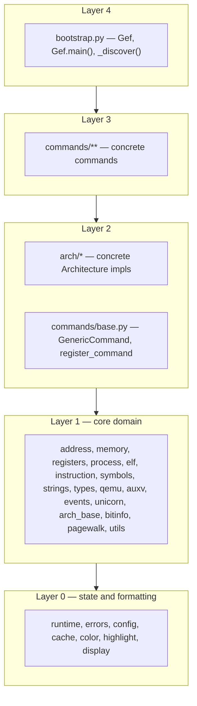

# GEF Architecture

**Status: Phase 2 complete.** The monolithic `gef.py` has been fully decomposed into the `gef/`
package: core domain modules, one file per architecture family, and all commands grouped into
category subpackages, all wired together by auto-discovery. This document is the canonical
contributor guide to that package — its layout, its layering rules, and how to extend it. It
follows the approved design in
`docs/superpowers/specs/2026-09-16-gef-modularization-design.md`.

---

## 1. How to use GEF (end users)

Nothing changed for end users. The entry point is the same as it was for the monolith; only the
code behind that entry point is now a package.

**Quick trial** (from a repo checkout, no install):

```gdb
source /path/to/gef-bootstrap.py
```

`gef-bootstrap.py` lives at the repo root. It prepends its own directory to `sys.path`, then runs
`from gef import *` followed by `Gef.main()` — importing the sibling `gef/` package.

**Installed contract** (the `.gdbinit` line, unchanged from the monolith era):

```gdb
python sys.path.insert(0, "/root/.gef"); from gef import *; Gef.main()
```

The installer scripts (`install-uv.sh`, `install-no-uv.sh`, `install-minimal.sh`) fetch the
fork's repo archive
(`https://github.com/MarcoApollonio02/gef/archive/refs/heads/dev.tar.gz`), extract it, and install
the package into `/root/.gef`: the `gef/` package directory at `/root/.gef/gef/` plus the shim at
`/root/.gef/gef-bootstrap.py` (any legacy `/root/.gef/gef.py` is removed). The `.gdbinit` line is
unchanged, as above. Upgrading re-downloads the same archive through the shim:

```bash
python3 /root/.gef/gef-bootstrap.py --upgrade
```

`gef/core/update.py` implements that path (it validates the archive, stages the new `gef/` and
`gef-bootstrap.py`, and swaps them in atomically). `from gef import *` runs `gef/__init__.py`,
which re-exports the public API lazily via PEP 562 `__getattr__`: `import gef` and
`from gef import *` succeed even outside a GDB session, and the underlying modules (which need
GDB's embedded Python) are imported on first attribute access. Command and architecture
implementation classes are deliberately *not* individually re-exported — reach them through their
submodules or the registries (see §6).

---

## 2. Package layout (contributors)

The tree below is verified against the repo.

```text
gef/
├── __init__.py          # PEP 562 lazy re-export of the public API
├── bootstrap.py         # Gef, Gef.main(), _discover() auto-discovery, update_gef
├── core/                # Layer 0–1: state, primitives, domain types
│   ├── runtime.py       # mutable state: current_arch, CommandRegistry, ArchRegistry, missing_modules
│   ├── errors.py        # GefError, show_last_exception
│   ├── config.py        # Config  (the `gef config` store)
│   ├── cache.py         # Cache   (until-next / this-session memoization)
│   ├── color.py         # Color, gef_print, ok, err, info, warn, titlify
│   ├── highlight.py     # highlight_text (extracted from HighlightCommand to avoid core→commands)
│   ├── display.py       # DisplayHook, hexon/hexoff
│   ├── address.py       # Address, AddressUtil, Permission, Section, Endian
│   ├── memory.py        # read_memory, read_int_from_memory, hexdump, p8..u128
│   ├── registers.py     # get_register, to_unsigned_long
│   ├── process.py       # is_alive, get_arch, set_arch, all is_*() mode checks
│   ├── elf.py           # Elf, Checksec
│   ├── instruction.py   # Instruction, Disasm, get_insn{,_next,_prev}
│   ├── symbols.py       # Symbol, ModuleLoader
│   ├── strings.py       # String
│   ├── types.py         # GenericType, GlibcHeap
│   ├── qemu.py          # QemuMonitor, phys-mem helpers
│   ├── auxv.py          # Auxv
│   ├── events.py        # EventHandler, EventHooking
│   ├── unicorn.py       # UnicornKeystoneCapstone
│   ├── arch_base.py     # Architecture abstract contract (the sole core→arch exception)
│   ├── bitinfo.py       # BitInfo
│   ├── pagewalk.py      # PageMap, KernelAddressHeuristicFinder
│   ├── utils.py         # GefUtil, align*, rol/ror, slice_unpack, perf timers, GEF_FILEPATH
│   ├── exec.py          # ExecAsm, ExecSyscall (inline-asm execution helpers)
│   ├── hash.py          # Hash (pure-Python hash algorithms)
│   ├── heap.py          # GlibcHeapBinsDump, uClibcNgHeap (non-command heap helpers)
│   ├── kernel.py        # KernelConstsBase, Kernel (kernel knowledge/helpers)
│   └── syscall.py       # syscall data tables + Syscall base and its arch subclasses
├── arch/                # Layer 2: one file per architecture family
│   ├── __init__.py
│   ├── x86.py           # X86, X86_64, X86_16
│   ├── arm.py           # ARM, AARCH64
│   ├── riscv.py         # RISCV, RISCV64
│   ├── ppc.py           # PPC, PPC64
│   ├── sparc.py         # SPARC, SPARC32PLUS, SPARC64
│   ├── mips.py          # MIPS, MIPS64, MIPSN32
│   ├── arc.py           # ARC, ARCv3, ARC64
│   ├── hppa.py          # HPPA, HPPA64
│   └── alpha.py  cris.py  csky.py  loongarch64.py  m68k.py  microblaze.py
│       nios2.py  or1k.py  s390x.py  sh4.py  xtensa.py
└── commands/            # Layer 2–3: base + category subpackages
    ├── __init__.py
    ├── base.py          # GenericCommand, BufferingOutput, GefAlias, register_command, guard decorators
    ├── debugging/       # 01-*: assemble, breakpoint, context, emulate, exec_until, other, syscall
    ├── process/         # 02-*: base_address, general, info, memory_section, security, structure, symbol, type
    ├── memory/          # 03-*: calc, compare, dump, investigate, patch, search, view
    ├── registers/       # 04-*: modify, view
    ├── heap/            # 05-*: chromium, glibc, other
    ├── kernel/          # 06-*: advanced, allocator, basic, dynamic, other, page, pagewalk, register,
    │                    #       symbol_type, task, trustzone
    ├── misc/            # 07-*: calc, convert, diff, generation, hint, qemu, search
    └── maintenance/     # 99: aliases, gef_cmds (gef config/save/restore/reload/missing/set-arch/...)
```

### Layering (L0–L4)

Dependencies flow one direction only: higher layers may import lower ones, never the reverse.

```text
Layer 0  runtime, errors, config, cache, color, highlight, display
         (state + formatting primitives)
Layer 1  address, memory, registers, process, elf, instruction, symbols, strings, types,
         qemu, auxv, events, unicorn, arch_base, bitinfo, pagewalk, utils
         (core domain types; depend on Layer 0 only)
Layer 2  arch/*            (concrete Architecture implementations)
Layer 2  commands/base     (GenericCommand, BufferingOutput, register_command, parse_args)
Layer 3  commands/**       (concrete commands)
Layer 4  bootstrap         (Gef, main, auto-discovery; orchestrates everything)
```

The migration also added a handful of core modules that fit these same tiers — `core/exec.py`
(inline-asm helpers, Layer 1), `core/kernel.py` (kernel constants/helpers, Layer 1),
`core/heap.py` (non-command heap helpers), `core/hash.py` (hash algorithms), and
`core/syscall.py` (syscall data tables and the `Syscall` hierarchy). None of them break the rules
below.



### Dependency rules

1. **Core never imports `arch/*` or `commands/*` at module import time.** This is what guarantees
   no import-time cycles. The only cross-layer import at module scope is `core/arch_base.py`, the
   abstract contract `set_arch` needs. Where core needs a concrete command or architecture at
   *runtime*, it reaches up through a function-local (late) import inside the method that needs it —
   39 such late imports exist today across `core/syscall.py`, `core/pagewalk.py`, `core/types.py`,
   `core/unicorn.py`, `core/symbols.py`, `core/process.py` and others — so nothing executes at import
   time. This is likewise why `highlight.py` lives in core: `gef_print` needs highlighting, and
   pulling it from the command layer would invert the layering.
2. **`arch/*` never imports `commands/*`.** Architectures are a pure leaf layer; they depend only
   on `core.arch_base` and Layers 0–1.
3. **Commands may import `core`, `arch`, and `commands.base`** — plus other bases co-located in the
   same file. Inheritance families stay together in one file, so a base is always defined before its
   subclasses regardless of import order.
4. **`bootstrap` is the only module that imports everything.** It imports both packages and drives
   auto-discovery; nothing else needs a global view.

### Auto-discovery

`bootstrap._discover(package)` walks a package recursively with `pkgutil.walk_packages`, imports
every submodule in deterministic alphabetical order, and records failures in
`runtime.missing_modules` instead of aborting. Importing a module executes its class definitions,
which fires `@register_command` (appending to `CommandRegistry`) and registers `Architecture`
subclasses for `ArchRegistry`. `Gef.main()` wires `ArchRegistry._base = Architecture`, then calls
`_discover(gef.arch)` and `_discover(gef.commands)` before `Gef.load_commands()` instantiates
everything in `runtime.CommandRegistry.registered`.

The practical consequence: **drop a file in and it registers** — no central list to edit. A
category subdirectory needs no registration either; the walk is recursive. A single broken module
never prevents the others from loading, but note the two failure channels are distinct: a module
that fails to *import* is recorded in `runtime.missing_modules` and never registers at all (it
never runs its `@register_command`), so it does not appear in `gef missing`; `gef missing` reports
commands that registered but failed to *instantiate* in `Gef.load_commands()`, which populates
`Gef.missing_commands`.

### The `current_arch` rule (critical)

`runtime.current_arch` is the one mutable global that is **rebound** (not mutated in place) when
`set_arch()` switches architecture. Python's name binding makes
`from gef.core.runtime import current_arch` capture a *snapshot* at import time; after a later
`set_arch()`, that imported name still points at the old architecture object. The stale-binding bug
is silent and pernicious, so it gets a hard rule.

**Rule:** always read it as a qualified attribute; never import the name, and never rebind a bare
`current_arch` outside `runtime.py`:

```python
from gef.core import runtime
...
sp = runtime.current_arch.sp
```

`runtime.set_current_arch()` is the only writer, called from `core/process.py`'s `set_arch()`.

Enforcement — the exact check from the project's Global Constraints:

```bash
grep -rn '\bcurrent_arch\b' gef/ --include='*.py' | grep -v 'gef/core/runtime.py' | grep -v 'runtime.current_arch' | grep -v '#'
```

After excluding `runtime.py` itself, qualified `runtime.current_arch` reads, and comments, the
only hits left are human-readable **string literals** (help text like
`"(default: current_arch.pc)"`, error messages, docstrings) — never code reads. Add a string
exclusion to assert that mechanically:

```bash
# No unqualified code read of current_arch remains anywhere in the package.
grep -rn '\bcurrent_arch\b' gef/ --include='*.py' \
  | grep -v 'gef/core/runtime.py' | grep -v 'runtime.current_arch' \
  | grep -v '#' | grep -v '"'   # EMPTY
```

---

## 3. Adding a new command (contributor workflow)

1. Create `gef/commands/<category>/foo.py` (pick the category directory whose `_category_` prefix
   matches; see the tree in §2).
2. Subclass `GenericCommand`, set its metadata, implement `do_invoke`, and decorate with
   `@register_command`. A complete, minimal, working example:

```python
"""Example: gef/commands/misc/hello.py."""

import argparse

from gef.commands.base import GenericCommand, parse_args, register_command
from gef.core.color import gef_print


@register_command
class HelloCommand(GenericCommand):
    """Print a short greeting."""

    _cmdline_ = "hello"
    _category_ = "07-d. Misc - Show Example"   # groups this command in docs/COMMANDS.md

    parser = argparse.ArgumentParser(prog=_cmdline_)
    parser.add_argument("who", nargs="?", default="world", help="whom to greet")
    parser.add_argument("-q", "--quiet", action="store_true", help="do not print anything")
    _syntax_ = parser.format_help()

    _example_ = "{0:s}\n{0:s} -q".format(_cmdline_)
    _note_ = "A minimal demonstration command."
    _aliases_ = ["hi"]

    @parse_args
    def do_invoke(self, args):
        if not args.quiet:
            gef_print("Hello, {}!".format(args.who))
        return
```

3. That is the whole workflow — there is no registry list to edit. `Gef.main()` imports the module,
   `@register_command` appends the class to `runtime.CommandRegistry.registered`, and
   `Gef.load_commands()` instantiates it and wires its `_aliases_` through `GefAlias`.
4. Regenerate the command reference with `gef dump-commands` (see §7).

Metadata fields, as defined on `commands/base.py`:

| Field | Role |
|---|---|
| `_cmdline_` | the GDB command name (`"hello"`, `"gef dump-commands"`, ...) |
| `_category_` | `docs/COMMANDS.md` grouping label, e.g. `"07-d. Misc - Show Example"` |
| `_syntax_` | usage/help text (commonly `parser.format_help()`) |
| `_example_` | example invocation shown in help |
| `_note_` | optional extra note |
| `_aliases_` | optional list of alias names, registered as `GefAlias` wrappers |

`commands/base.py` also provides the `@parse_args` decorator (which parses `self.parser` and calls
`do_invoke` with the resulting namespace) and the guard decorators used across the tree —
`only_if_gdb_running`, `only_if_gdb_target_local`, `only_if_in_kernel`,
`only_if_in_kernel_or_kpti_disabled`, `only_if_kvm_disabled`, `only_if_smp_disabled`,
`require_arch_set`, `only_if_specific_gdb_mode`, `exclude_specific_gdb_mode`,
`only_if_specific_arch`, `exclude_specific_arch`, and `only_if_events_supported` (re-exported from
`core/events.py`). `BufferingOutput` is a mixin that collects output in `self.out` for
pager/terminal-aware rendering.

---

## 4. Adding a new architecture

1. Create `gef/arch/foo.py`, subclass `Architecture` from `gef/core/arch_base.py`, set
   `load_condition`, and implement the base's abstract members:

```python
"""Example: gef/arch/foo.py."""

from gef.core.arch_base import Architecture


class Foo(Architecture):
    """GEF representation of the Foo architecture."""

    arch = "FOO"
    mode = "32"

    # Consulted by ArchRegistry.find() when set_arch() resolves the architecture.
    # A list of gdb arch-name strings and/or ELF machine IDs.
    load_condition = ["FOO", "FOO32"]

    all_registers = [...]
    alias_registers = {}
    special_registers = [...]
    flag_register = "$flags"
    flags_table = {...}
    return_register = "$ret"
    function_parameters = [...]
    syscall_register = "$syscall"
    syscall_parameters = [...]
    bit_length = 32
    endianness = ...
    instruction_length = 4
    nop_insn = ...
    ret_insn = ...
    syscall_insn = ...
    # ... plus the remaining abstract members (see below)
```

2. Done — no registry edit. `_discover(gef.arch)` imports the module, and at `set_arch()` time
   `ArchRegistry.find()` walks `Architecture.__subclasses__()` breadth-first, matching each
   class's `load_condition` entries case-insensitively (this replaces the lookup the monolith
   inlined in `set_arch`).

The abstract contract in `core/arch_base.py` includes (among others): `arch`, `mode`,
`load_condition`; register tables (`all_registers`, `alias_registers`, `special_registers`,
`flag_register`, `flags_table`, `return_register`, `function_parameters`, `syscall_register`,
`syscall_parameters`); architecture traits (`bit_length`, `endianness`, `instruction_length`,
`has_delay_slot`, `has_syscall_delay_slot`, `has_ret_delay_slot`, `stack_grow_down`, `tls_supported`,
`keystone_support`, `capstone_support`); instruction templates (`nop_insn`, `infloop_insn`,
`trap_insn`, `ret_insn`, `syscall_insn`); predicates (`is_syscall`, `is_call`, `is_jump`, `is_ret`,
`is_conditional_branch`, `is_branch_taken`); and helpers (`flag_register_to_human`, `get_ra`,
`get_tls`, `decode_cookie`, `encode_cookie`, `pc`, `sp`, `ptrsize`, `get_ith_parameter`,
`get_aliased_registers`, `get_aliased_registers_name_max`, `get_registers_name_max`,
`flags_to_human`).

---

## 5. How things changed (migration summary)

- **What the monolith was:** a single `gef.py` — 160,592 lines and 550 classes, with 416
  `@register_command`-decorated classes, all command and architecture classes in one namespace,
  mutated through module-level globals (`__gef_commands__`, `__gef_command_instances__`,
  `__gef_alias_instances__`, `current_arch`, ...).
- **What the package is now:** a modular tree where commands and architectures are auto-discovered
  rather than declared, and shared state is funnelled through `runtime` and its registries. The
  package registers 415 command classes today (333 subclass `GenericCommand` directly; the rest
  inherit from extracted command families such as `ExecUntilCommand` and `PagewalkCommand`), as
  listed in `docs/COMMANDS.md`.
- **Where components moved:** core domain types and state → `gef/core/`; the 19 architecture family
  modules → `gef/arch/` (one file each, families co-located); commands →
  `gef/commands/<category>/` across eight category directories (`debugging`, `process`, `memory`,
  `registers`, `heap`, `kernel`, `misc`, `maintenance`); the `Gef` class, `main()`, and
  discovery → `gef/bootstrap.py`.
- **The `current_arch` rule and why:** the migration's one non-mechanical rewrite was bare
  `current_arch` → `runtime.current_arch` across every module. `current_arch` is the only global
  that is rebound rather than mutated in place, so a name imported from `runtime` goes stale after
  `set_arch()`. §2 gives the rule and the grep that enforces it.
- **The monolith is removed by this phase:** Phase 2.9 deletes the single `gef.py`, leaving the
  `gef/` package (entered via `gef-bootstrap.py` for quick trials or `from gef import *;
  Gef.main()` when installed) as the sole source of GEF.

---

## 6. The registry seam (for the C-track)

Even though the current architecture is a structural refactor ("B"), it deliberately introduces the
seams the C-track will exploit. Both registries live in `gef/core/runtime.py`:

- **`CommandRegistry`** — `registered` (list of command classes, the old `__gef_commands__`) and
  `instances` (a `_cmdline_ → instance` dict, the old `__gef_command_instances__`), with
  `register(cls)` and `get(name)` class methods. `@register_command` is a thin wrapper over
  `CommandRegistry.register`.
- **`ArchRegistry`** — `all()` returns every `Architecture` subclass (breadth-first over
  `__subclasses__()`), and `find(arch_str)` matches `load_condition` case-insensitively. `set_arch`
  delegates to it instead of inlining the traversal.

Today these are thin class-level wrappers around what used to be bare globals. The C-track change is
localised: `runtime` becomes an injectable `Session`/`Context` object, so `runtime.current_arch`
becomes `session.current_arch` and the registries become instance attributes of a service — without
touching command or architecture code, which already accesses everything through `runtime.*`. The
same path narrows the `from gef import *` surface and extends auto-discovery to further registrable
categories (heap analyzers, breakpoint tracers) following this exact pattern.

---

## 7. Command documentation

`docs/COMMANDS.md` is generated from each command's own metadata (`_category_`, `_syntax_`,
`_example_`, `_note_`, `_aliases_`). Regenerate it after adding or editing commands:

```gdb
gef dump-commands
```

`GefDumpCommandsCommand` (`gef/commands/maintenance/gef_cmds.py`) renders the file from
`runtime.CommandRegistry.instances`. Because the metadata travels with each command class into its
new module, there is no separate command reference to maintain by hand — the structure is the
documentation, `ARCHITECTURE.md` is the map, and `COMMANDS.md` is the auto-generated reference.
